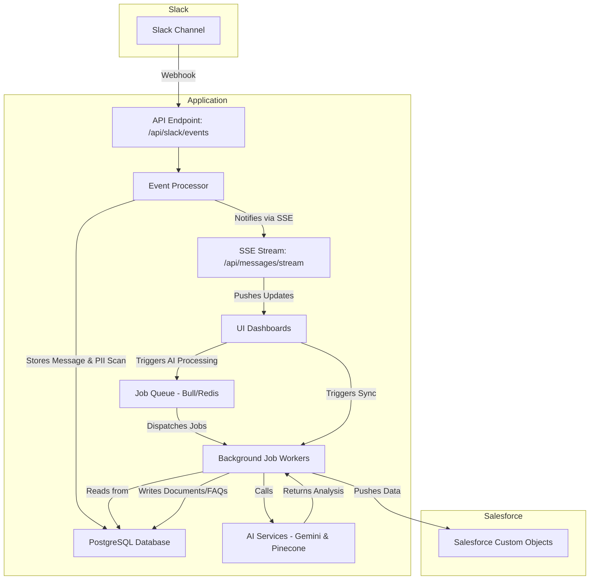

# Application Architecture

This document provides a comprehensive overview of the SF Listen Bot application, covering its business objectives, system architecture, technology stack, and key features.

## 1. Business & Solution Overview

This application is an **Enterprise AI-Powered Knowledge Management Platform**. It transforms unstructured conversations from Slack into valuable, organized, and compliant assets, and syncs them directly into Salesforce.

### 1.1. Core Business Process

The application follows a robust, multi-stage pipeline:

1.  **Data Ingestion**: Monitors and ingests conversations from designated Slack channels in real-time (`/api/slack/events`) and via a historical data importer (`/pages/slack/channel-pull`).
2.  **Synchronous Processing**: Each incoming message is immediately saved to the database and scanned for PII. The UI is updated in near real-time via an SSE stream.
3.  **Asynchronous AI Analysis**: On user command, long-running background jobs are initiated to perform heavy AI tasks. This includes analyzing conversations, identifying topics, and generating titles and summaries for documents.
4.  **Knowledge Asset Generation**: The secure, analyzed data is used to generate two key assets:
    *   **Curated Documents**: Structured `ProcessedDocument` records that group related messages into a coherent conversation.
    -   **FAQs**: AI-generated `FAQ` records with built-in duplicate detection via vector search.
5.  **Salesforce Integration**: The final, curated knowledge assets are synced to custom objects in Salesforce, making them available to sales and service teams.

## 2. Technology Stack

*   **Frontend**: Next.js, React, TypeScript, Tailwind CSS, Lucide React, Server-Sent Events (SSE).
*   **Backend**: Next.js API Routes, Prisma.
*   **Job Queuing**: Bull with Redis for managing asynchronous background tasks.
*   **AI & Machine Learning**: Google Gemini for content analysis and generation, Pinecone for vector search and semantic duplicate detection.
*   **Database**: PostgreSQL for primary data, Redis for queue management.
*   **Deployment**: Vercel.

## 3. System Architecture

The application is a monolithic Next.js application designed for serverless deployment on Vercel. It uses a hybrid synchronous/asynchronous model to balance real-time feedback with scalable processing.

### 3.1. High-Level System Flow

### 3.2. Architectural Layers & Patterns

*   **Frontend**: A Next.js application serving the user interface, built with a **feature-based component structure**. It uses a custom hook (`useRealTimeMessages`) to consume an SSE stream for live updates.
*   **Backend (API)**: A set of Next.js API routes. The system distinguishes between synchronous endpoints for fast operations (like message ingestion) and endpoints that trigger asynchronous jobs for slow operations.
*   **Data Layer**: A PostgreSQL database with a schema managed by **Prisma**. All models and relations are defined in `prisma/schema.prisma`.
*   **Services**: A collection of modular libraries in `src/lib` for interacting with external APIs (Slack, Gemini, Pinecone, Salesforce) and implementing core business logic.
*   **Automation & Job Queue**: A **Bull/Redis queue** (`src/lib/backgroundJobs.ts`) manages all long-running, resource-intensive tasks, ensuring the API remains responsive and tasks are processed reliably.

## 4. Detailed Architecture

### 4.1. Data Layer

The `prisma/schema.prisma` file defines all data models. Key models include:

*   `Message`: Stores raw Slack messages and thread relationships.
*   `ProcessedDocument`: An AI-generated summary of a conversation, acting as a container for related messages.
*   `FAQ`: An AI-generated Question/Answer pair, linked back to a source `ProcessedDocument`.
*   `PIIDetection`: Tracks every piece of PII found, its status (`PENDING_REVIEW`, `WHITELISTED`, etc.), and how it was redacted. This provides a full compliance audit trail.
*   `AutomationJob`: Represents a background task (e.g., `DOCUMENT_CREATION`), tracking its progress, status, and any errors.
*   `SlackEvent`: Logs every incoming webhook payload from Slack for reliability and debugging.
*   **Junction Tables**: `DocumentMessage`, `DocumentFAQ`, and `MessageFAQ` create many-to-many relationships, providing rich traceability from a final FAQ back to the individual messages that created it.

### 4.2. Functional Map by Feature

*   **Slack Data Ingestion**:
    *   **Real-time**: `src/pages/api/slack/events.ts`, `src/lib/eventProcessor.ts`.
    *   **Historical**: `src/pages/slack/channel-pull.tsx`, `src/lib/slackChannelPuller.ts`.

*   **Content Processing & AI**:
    *   **Document Processing**: `src/lib/documentProcessor.ts`, triggered by a `DOCUMENT_CREATION` job.
    *   **FAQ Generation**: `src/lib/faqGenerator.ts`, triggered by an `FAQ_GENERATION` job.
    *   **PII Detection**: `src/lib/piiDetector.ts` (used synchronously by `eventProcessor`).
    *   **AI Service**: `src/lib/gemini.ts` (contains all prompts and logic for interacting with the LLM).

*   **Salesforce Integration**:
    *   **Authentication**: Full OAuth 2.0 flow (`/api/salesforce/oauth`).
    *   **Data Sync**: `src/lib/salesforceSync.ts` handles mapping and pushing data.
    *   **Schema Deployment**: `src/lib/salesforceCLI.ts` and `salesforceMetadataDeployer.ts` manage creating custom objects and fields in the target org.

*   **User Interface**:
    *   **Main Application Shell**: `src/pages/_app.tsx`, `src/components/Header.tsx`.
    *   **Dashboards**:
        *   `src/pages/index.tsx`: Message Feed
        *   `src/pages/documents/index.tsx`: Document Management
        *   `src/pages/faqs/index.tsx`: FAQ Management & Approval
        *   `src/pages/pii/review.tsx`: PII Review Workflow
        *   `src/pages/processing/dashboard.tsx`: System Analytics
        *   `src/pages/processing/automation.tsx`: Automation & Job Control
        *   `src/pages/salesforce/index.tsx`: Salesforce Connection & Sync

### 4.3. Security

*   **Slack**: All incoming webhooks are verified using the Slack signing secret (`verifySlackSignature` in `src/lib/slack.ts`).
*   **Salesforce**: Authentication is handled via a secure OAuth 2.0 flow with PKCE. Access and refresh tokens are encrypted and stored securely in the database (`SalesforceConnection` model).
*   **Data**: PII is actively detected, logged, and redacted. The PII review dashboard provides a human-in-the-loop mechanism for compliance.

This document will be updated as the application evolves.
