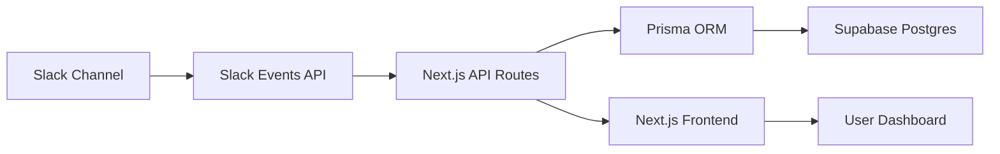

# Listen Bot MVP - Technical PRD

## 🎯 Product Overview

**Listen Bot** is a Slack message logger that captures messages from designated channels and displays them in a modern web dashboard.

### MVP Goals
- ✅ Capture Slack messages via webhooks
- ✅ Store messages in Postgres (Supabase)
- ✅ Display messages in real-time dashboard
- ✅ Simple, secure, and scalable architecture

---

## 🏗️ System Architecture



### Core Components

| Component | Technology | Purpose |
|-----------|------------|---------|
| **Frontend** | Next.js 14 + Tailwind v4 | Message dashboard & UI |
| **Backend API** | Next.js API Routes | Event processing & validation |
| **Database** | Supabase Postgres | Message persistence |
| **ORM** | Prisma | Database operations |
| **Hosting** | Vercel | Application deployment |
| **Auth** | Slack App Signing Secret | Request validation |

---

## 📊 Database Schema

### Messages Table
```prisma
model Message {
  id        String   @id @default(cuid())
  slackId   String   @unique
  text      String
  userId    String
  username  String
  channel   String
  timestamp DateTime
  createdAt DateTime @default(now())
  updatedAt DateTime @updatedAt
  
  @@map("messages")
}
```

### Optional: Channels Table (Future Enhancement)
```prisma
model Channel {
  id       String    @id @default(cuid())
  slackId  String    @unique
  name     String
  messages Message[]
  
  @@map("channels")
}
```

---

## 🔌 API Endpoints

### Slack Webhook Handler
```typescript
// pages/api/slack/events.ts
POST /api/slack/events
- Validates Slack signature
- Handles url_verification challenge
- Processes message events
- Stores to database
```

### Frontend API
```typescript
// pages/api/messages.ts
GET /api/messages
- Fetches paginated messages
- Filters by channel/date
- Returns formatted data

// pages/api/messages/[id].ts  
GET /api/messages/[id]
- Fetches single message
- Message details view
```

---

## 🎨 UI/UX Design

### Dashboard Layout
```
┌─────────────────────────────────────┐
│ Listen Bot Dashboard                 │
├─────────────────────────────────────┤
│ [Search] [Filter] [Channel Select]  │
├─────────────────────────────────────┤
│ Message Feed                        │
│ ┌─────────────────────────────────┐ │
│ │ @username • #channel • 2:30 PM │ │
│ │ Hello, this is a test message   │ │
│ └─────────────────────────────────┘ │
│ ┌─────────────────────────────────┐ │
│ │ @alice • #general • 2:25 PM    │ │
│ │ Anyone available for standup?   │ │
│ └─────────────────────────────────┘ │
└─────────────────────────────────────┘
```

### Component Structure
- `MessageFeed` - Main message list
- `MessageCard` - Individual message display
- `FilterBar` - Search and filtering
- `ChannelSelector` - Channel switching
- `RealTimeUpdater` - Live message updates

---

## 🔐 Security & Validation

### Slack Event Validation
```typescript
// Verify request signature
const signature = headers['x-slack-signature']
const timestamp = headers['x-slack-request-timestamp']
const body = rawBody

const computedSignature = crypto
  .createHmac('sha256', SLACK_SIGNING_SECRET)
  .update(`v0:${timestamp}:${body}`)
  .digest('hex')

const isValid = `v0=${computedSignature}` === signature
```

### Environment Variables
```bash
# .env.local
DATABASE_URL="postgresql://..."
SLACK_SIGNING_SECRET="your_slack_signing_secret"
NEXT_PUBLIC_APP_URL="https://your-app.vercel.app"
```

---

## 📝 Implementation Phases

### Phase 1: Core Backend (Week 1)
- [ ] Next.js project setup
- [ ] Prisma schema & migrations
- [ ] Slack webhook endpoint
- [ ] Message storage logic
- [ ] Basic validation

### Phase 2: Frontend Dashboard (Week 2)  
- [ ] Tailwind v4 setup
- [ ] Message feed component
- [ ] Real-time updates
- [ ] Basic filtering
- [ ] Responsive design

### Phase 3: Polish & Deploy (Week 3)
- [ ] Error handling
- [ ] Logging system
- [ ] Vercel deployment
- [ ] Performance optimization
- [ ] Testing & QA

---

## 🚀 Deployment Strategy

### Railway Configuration
```toml
# railway.toml
[build]
command = "pnpm build"

[deploy]
startCommand = "pnpm start"

[env]
NODE_ENV = "production"
```

### Database Migration
```bash
# Production deployment
npx prisma migrate deploy
npx prisma generate
```

---

## 📊 Success Metrics

### Technical KPIs
- **Response Time**: < 200ms for API calls
- **Uptime**: 99.9% availability
- **Message Processing**: < 1s from Slack to DB
- **UI Load Time**: < 2s initial page load

### User Experience
- Real-time message updates
- Intuitive search/filtering
- Mobile-responsive design
- Zero message loss

---

## 🔮 Future Enhancements

### V2 Features
- Multiple channel support
- Message reactions/threads
- Export functionality
- Advanced analytics
- User management
- Slack app distribution

### Technical Improvements
- Redis caching
- WebSocket connections
- Message queuing
- Advanced monitoring
- Automated testing

---

## 🛠️ Development Commands

```bash
# Setup
pnpm create next-app@latest sf-listen-bot --typescript --tailwind --app
cd sf-listen-bot
pnpm add prisma @prisma/client @supabase/supabase-js

# Development
pnpm dev              # Start dev server
pnpm db:push          # Push schema to DB  
pnpm db:studio        # Open Prisma Studio
pnpm build            # Build for production
pnpm verify           # Run linting & type check

# Database
npx prisma generate   # Generate client
npx prisma migrate dev # Create migration
npx prisma studio     # Database GUI
```

---

## 📋 Definition of Done

### MVP Complete When:
- ✅ Slack messages are captured and stored
- ✅ Web dashboard displays messages in real-time
- ✅ Basic filtering/search functionality
- ✅ Deployed and accessible via Vercel
- ✅ Proper error handling and logging
- ✅ Mobile-responsive design
- ✅ Production-ready security measures

---

*This PRD serves as the single source of truth for the Listen Bot MVP development.* 